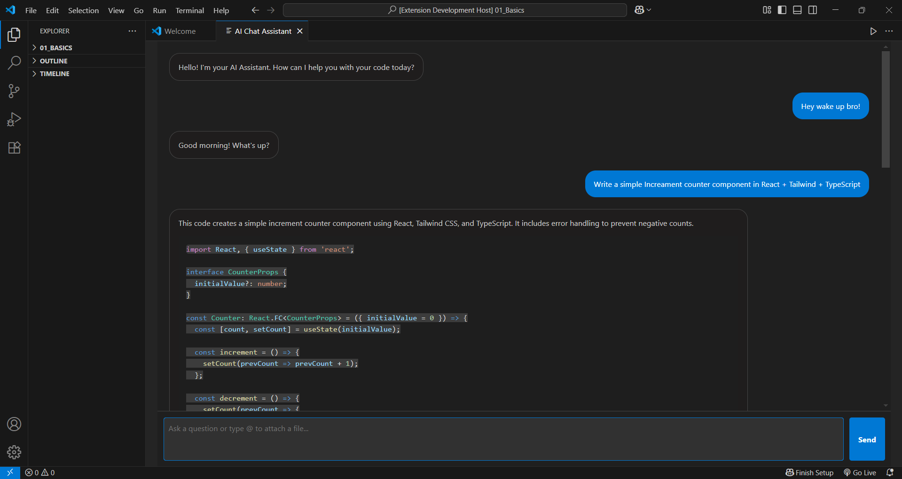

# AI Chat Assistant ✨

Your own personal AI coding companion, right inside Visual Studio Code!

This extension provides a powerful, React-based chat interface that is context-aware of your workspace. Ask questions about your code, generate new snippets, and get help without ever leaving your editor.

  <!-- You can add a screenshot later! -->

## Features

*   **📝 Context-Aware Chat:** Attach files to your prompts using `@` mentions (e.g., `Refactor this function in @src/utils.js`). The assistant will read the file content to give you precise answers.
*   **💻 Code Generation:** Ask the assistant to generate new code, from simple functions to entire components.
*   **🎨 Markdown & Syntax Highlighting:** AI responses are beautifully formatted with full markdown support and syntax-highlighted code blocks, making them easy to read and use.
*   **🔒 Secure:** Your OpenAI API key is stored securely on your local machine using VS Code's SecretStorage and is never shared.

## How to Use

1.  **Install the Extension:** Find it on the VS Code Marketplace.
2.  **Set Your API Key:**
    *   Open the Command Palette (`Ctrl+Shift+P` or `Cmd+Shift+P`).
    *   Run the command `AI Chat Assistant: Set API Key`.
    *   Paste your personal OpenAI API key and press Enter. This only needs to be done once.
3.  **Start Chatting:**
    *   Run the command `AI Chat Assistant: Start` to open the chat panel.
    *   Start asking questions!

## Requirements

You must have a valid API key from [OpenAI](https://platform.openai.com/api-keys) to use this extension.

## Known Issues

Report any issues or suggest features on the [GitHub Issues page](https://github.com/YOUR_GITHUB_USERNAME/YOUR_REPO_NAME/issues).

---
**Enjoy!**