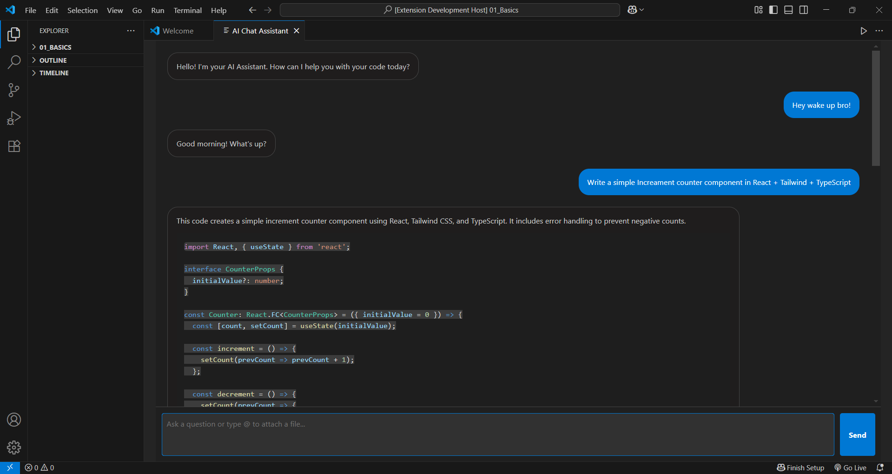

# AI Chat Assistant - VS Code Extension

[](https://marketplace.visualstudio.com/)
[](https://marketplace.visualstudio.com/items?itemName=aakashPalBhu.ai-chat-assistant)

An intelligent coding companion powered by Google Gemini, living directly inside your Visual Studio Code editor. This extension provides a powerful, React-based chat interface that is context-aware of your workspace. Ask questions about your code, generate new snippets, and get help without ever leaving your development environment.

---

## Table of Contents

- [Extension Preview](#extensionPreview)
- [Features](#features)
- [Tech Stack](#tech-stack)
- [Project Structure](#project-structure)
- [Prerequisites](#prerequisites)
- [Setup and Running for Development](#setup-and-running-for-development)
  - [Backend Setup](#backend-setup)
  - [Frontend Setup](#frontend-setup)
  - [Running the Extension](#running-the-extension)
- [Setup and Installation from VS Code Marketplace](#setup-and-installation-from-vs-code-marketplace)
- [How to Use](#how-to-use)
- [Contributing](#contributing)
- [License](#license)
- [Contact Information](#contact-information)
---

## Extension Preview


---

## Features

*   **Context-Aware Chat:** Attach files to your prompts using `@` mentions (e.g., `Refactor this function in @src/utils.js`) — the assistant reads and uses their content to improve response accuracy.
*   **AI-Powered Code Generation:** Powered by Google’s **Gemini 1.5 Flash** model for smart, contextual code suggestions.
*   **Markdown + Syntax Highlighting** AI responses support markdown and highlight code for better readability.
*   **Secure by Design:** Your API key is stored safely using VS Code's built-in **SecretStorage** — never exposed or shared.
*   **Modern UI:** Clean React-based chat interface embedded directly inside VS Code.

---

## Tech Stack

- **Extension Backend**: [Node.js](https://nodejs.org/), [TypeScript](https://www.typescriptlang.org/), [VS Code API](https://code.visualstudio.com/api)
- **Frontend UI**: [React](https://react.dev/), [Vite](https://vitejs.dev/)
- **AI Model**: [Google Gemini API](https://ai.google.dev/) @google/generative-ai
- **UI & Formatting**: [React Markdown](https://github.com/remarkjs/react-markdown), [React Syntax Highlighter](https://github.com/react-syntax-highlighter/react-syntax-highlighter)
- **Styling**: CSS Modules
---

## Project Structure

```
.
├── src/                    
│   └── extension.ts        # Main extension logic, API calls, WebView creation
├── webview-ui/             # React Application (Frontend)
│   ├── public/
│   ├── src/
│   │   ├── components/
│   │   ├── App.tsx
│   │   ├── App.css
│   │   ├── main.tsx
│   │   └── vscode.ts
│   ├── public/
│   ├── package.json
│   ├── vite.config.js
│   └── README.md
├── images/
├── .gitignore
├── package.json
└── README.md
```
---

## Prerequisites

To set up and run this project locally for development, you will need the following:

*   [**Node.js**](https://nodejs.org/en/download/) (v18.x or higher is recommended)
*   [**Visual Studio Code**](https://code.visualstudio.com/download)
*   A [**Google Gemini API Key**](https://aistudio.google.com/apikey) for testing the AI features.
---

## Setup and Running for Development

Follow these steps to get the extension running in a development environment.

### Backend Setup

1.  **Clone the repository:**
    ```bash
    git clone https://github.com/aakash4456/Ai-chat-assistant-extension.git
    ```

2.  **Navigate to the project's root directory:**
    ```bash
    cd Ai-chat-assistant-extension
    ```

3.  **Install the backend dependencies:**
    ```bash
    npm install
    ```

4.  **Compile the backend TypeScript:**
    * This command transpiles the code from /src into JavaScript in the /out directory.
    ```bash
    npm run compile
    ```


### Frontend Setup

1.  **Navigate to the frontend folder from the root directory:**
    ```bash
    cd webview-ui
    ```

2.  **Install the frontend dependencies:**
    ```bash
    npm install
    ```

3.  **Build the frontend assets:**
    *   This step is crucial as it creates the static files that the extension will load.
    ```bash
    npm run build
    ```

4.  **Navigate back to the root directory:**
    ```bash
    cd ..
    ```

### Running the Extension

1.  **Open the project root folder** in Visual Studio Code.
2.  **Press `F5`** on your keyboard (or go to `Run > Start Debugging`).
3.  This will compile the extension and launch a new **"Extension Development Host"** VS Code window.
4.  Inside the new window, open the **Command Palette** (`Ctrl+Shift+P` or `Cmd+Shift+P`).
5.  Run the command **`AI Chat: Start Session`** to see the extension in action.
6.  You can set your API key for testing using the **`AI Chat: Set API Key`** command.
---

## Setup and Installation from VS Code Marketplace

1.  **Install the Extension:** [Click me](https://marketplace.visualstudio.com/items?itemName=aakashPalBhu.ai-chat-assistant&ssr=false#overview) or Find **"AI Chat Assistant"** on the [VS Code Marketplace](https://marketplace.visualstudio.com/).
2.  **Get a Google Gemini API Key:**
    *   You must have a valid API key from Google AI Studio.
    *   Visit [aistudio.google.com/apikey](https://aistudio.google.com/apikey) to create one.
3.  **Set Your API Key in VS Code:**
    *   Open the Command Palette (`Ctrl+Shift+P` or `Cmd+Shift+P`).
    *   Run the command: `AI Chat: Set API Key`.
    *   Paste your personal Google Gemini API key and press `Enter`. This only needs to be done once.
---

## How to Use

1.  **Start a Chat Session:**
    *   Open the Command Palette (`Ctrl+Shift+P` or `Cmd+Shift+P`).
    *   Run the command: `AI Chat: Start Session`.
    *   This will open the chat panel in a new tab.

2.  **Ask a Question:**
    *   Simply type your question into the input box and press `Enter`.
    *   Example: `Write a TypeScript function to debounce an input.`

3.  **Use File Context:**
    *   To ask a question about a specific file, type `@` to bring up the file picker.
    *   Select a file to attach it to your prompt.
    *   Example: `Can you explain the main logic in @src/extension.ts?`
---

## Contributing

*   Fork the repository.
*   Create your feature branch (`git checkout -b feature/YourAmazingFeature`).
*   Commit your changes (`git commit -m 'Add some AmazingFeature'`).
*   Push to the branch (`git push origin feature/YourAmazingFeature`).
*   Open a Pull Request.
---

## License

This project is licensed under the MIT License. See the [LICENSE](LICENSE) file for details.

---

## Contact Information

- **Phone Number:** +91-6397185887
- **GitHub ID:** [aakash4456](https://github.com/aakash4456)
- **Email:** aakash4456bhu@gmail.com
- **LinkedIn:** [aakash4456](https://www.linkedin.com/in/aakash4456/)

---